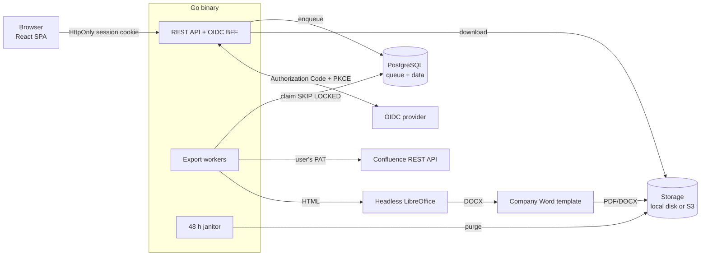

# Confluence → Word / PDF

Web application that lets a user pick a Confluence page and export it **with all of its child pages,
preserving the hierarchy**, as **Word (.docx)** or **PDF**.

- 🔐 Protected by **OAuth2 / OpenID Connect** (Keycloak, Entra ID, Okta, Google…)
- 🔑 Confluence is accessed with each user's **personal access token (PAT)**, entered in their preferences,
  verified against Confluence and stored **encrypted** (AES-256-GCM)
- ⏳ Generation is **asynchronous**, through a PostgreSQL-backed **queue** with bounded concurrency,
  per-user quotas and automatic recovery
- 🗑️ Every export stays downloadable for **48 h**, then it is deleted automatically
- 🏢 Documents can be produced in the **company format** from a Word template: header, footer, fonts and
  page layout (see [docs/word-template.md](docs/word-template.md))
- 🪣 Documents are stored on **local disk** or **S3 / S3-compatible** object storage
- 🛡️ **Audit trail** of sign-ins, exports and downloads, for administrators and the SIEM
- 📈 **OpenTelemetry** traces and metrics over OTLP, with trace ids in the logs
- 🌳 The hierarchy is preserved: numbered titles (`1`, `1.1`, `1.1.1`…), real Word/PDF heading levels,
  a table of contents, rewritten internal links and embedded images

## Quick start

### Option 1 — Docker Compose (everything included)

```bash
make up            # = docker compose up --build
```

Open <http://localhost:8080>, sign in (the mock OIDC provider signs you in automatically), then set the PAT
`dev-pat` in **Preferences**. The mock Confluence contains a demo tree (search for “Documentation”).

### Option 2 — Docker Compose, from the released image

Builds nothing and pulls the published image. No mocks: point it at a real OIDC provider and a real
Confluence in `.env`.

```bash
make up-release    # = docker compose -f docker-compose.release.yml up -d
```

The tag defaults to `latest`; pin it with `C2D_VERSION=1.2.3`. See [docs/releasing.md](docs/releasing.md).

### Option 3 — Kubernetes (Helm)

```bash
helm upgrade --install confluence-to-doc ./charts/confluence-to-doc \
  -n confluence-to-doc --create-namespace \
  -f charts/confluence-to-doc/values-production.yaml
```

The chart deploys the application only: PostgreSQL, object storage, Confluence and the OIDC provider stay
external. API and worker pods scale separately. See [charts/confluence-to-doc](charts/confluence-to-doc/).

### Option 4 — Locally, without Docker

Requirements: Go ≥ 1.26, Node ≥ 22, PostgreSQL ≥ 14, LibreOffice (`soffice`) for the conversion.

```bash
make install
cp .env.example .env && sed -i '' "s|^ENCRYPTION_KEY=.*|ENCRYPTION_KEY=$(openssl rand -base64 32)|" .env
make dev-mocks      # terminal 1: mock Confluence (:8090) + mock OIDC provider (:8091)
make dev-backend    # terminal 2: API + workers (:8080)
make dev-frontend   # terminal 3: Vite (:5173) — set PUBLIC_URL=http://localhost:5173 in .env
```

### Connecting the real services

| Variable              | Example                                                             |
| --------------------- | ------------------------------------------------------------------- |
| `OIDC_ISSUER_URL`     | `https://keycloak.example.com/realms/acme`                          |
| `OIDC_CLIENT_ID`      | **confidential** client, redirect URI `${PUBLIC_URL}/auth/callback` |
| `OIDC_CLIENT_SECRET`  | the client secret                                                   |
| `CONFLUENCE_BASE_URL` | `https://confluence.example.com` (Server / Data Center)             |
| `ENCRYPTION_KEY`      | `openssl rand -base64 32` (keep it in a vault)                      |
| `WORD_TEMPLATE_PATH`  | optional: company Word template applied to every document           |
| `S3_BUCKET`           | optional: switches document storage from local disk to S3           |
| `OTEL_EXPORTER_OTLP_ENDPOINT` | optional: enables OpenTelemetry traces and metrics           |

Every variable is described in [docs/configuration.md](docs/configuration.md).

## Architecture



One binary, three roles (`APP_ROLE=all|api|worker`) so the API and the workers scale independently.
Details in [docs/architecture.md](docs/architecture.md); decisions in [docs/adr/](docs/adr/).

## Documentation

| Document                                            | What it covers                                            |
| --------------------------------------------------- | --------------------------------------------------------- |
| [docs/architecture.md](docs/architecture.md)         | Components, export lifecycle, load control, security       |
| [docs/configuration.md](docs/configuration.md)       | Every environment variable, deployment notes               |
| [docs/word-template.md](docs/word-template.md)       | Preparing and troubleshooting the company Word template    |
| [docs/html-mapping.md](docs/html-mapping.md)         | What each HTML element becomes in the Word and PDF output  |
| [docs/agent-memory.md](docs/agent-memory.md)         | Durable project memory for AI agents and new contributors  |
| [docs/enterprise-hardening.md](docs/enterprise-hardening.md) | Enterprise hardening plan: decisions and lots      |
| [docs/operations/](docs/operations/README.md)        | Monitoring, SLOs, runbooks, backup, threat model, load tests |
| [docs/releasing.md](docs/releasing.md)               | Publishing the container image, tags, running a release    |
| [charts/confluence-to-doc/](charts/confluence-to-doc/) | Helm chart: values, storage choices, operational notes   |
| [docs/adr/](docs/adr/)                               | Architecture decision records                              |
| [CLAUDE.md](CLAUDE.md)                               | Entry point for AI coding agents                           |

## Development

```bash
make check   # lint + tests (backend and frontend) — what CI runs
make fmt     # formatting
make help    # all commands
```

- Backend tests: unit + PostgreSQL integration (`TEST_DATABASE_URL`) + real LibreOffice conversion
  (skipped cleanly when the tool is absent).
- Frontend tests: Vitest + Testing Library.
- End-to-end tests: Playwright drives the real server and LibreOffice against the fake Confluence and
  identity provider (`make e2e`); load tests use k6 (`loadtest/`, see
  [docs/operations/load-testing.md](docs/operations/load-testing.md)).

## Layout

```
backend/
  cmd/server        entry point (API, workers, janitor)
  cmd/devmocks      mock Confluence + mock OIDC provider (development and tests only)
  internal/
    account         preferences, PAT (validation + encryption)
    admin           administration console: queue, users, usage
    auth            OIDC (Authorization Code + PKCE), sessions, middleware
    confluence      Confluence REST client (+ fake/ for tests)
    converter       HTML → PDF/DOCX through LibreOffice
    doctemplate     which company Word template applies (uploaded or configured)
    docx            applies the company Word template to a generated document
    exporter        page-tree crawl + HTML assembly
    export          use cases: creation, worker pool, janitor
    httpapi         REST routes, middleware (CSRF, security, logs, tracing)
    observability   OpenTelemetry traces and metrics (OTLP)
    storage         document storage: local disk or S3 (feature flag)
    store           PostgreSQL (embedded migrations, job queue)
frontend/src/
  api/              typed HTTP client + React Query hooks
  pages/            screens (exports, new export, preferences, notifications, administration)
  components/       shared components
docs/               architecture, configuration, Word template, HTML mapping, releasing, ADRs
docs/operations/    monitoring, SLOs, runbooks, backup and recovery, threat model
e2e/                Playwright end-to-end tests
loadtest/           k6 load test
```
