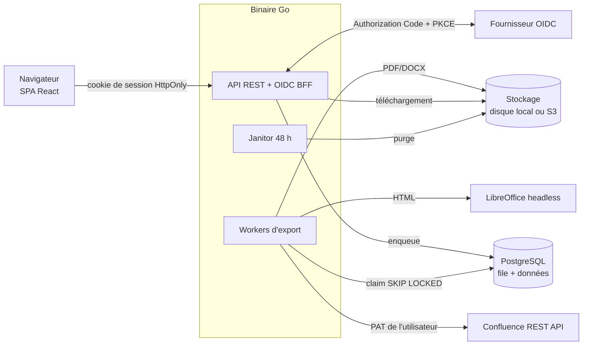

# Confluence → Word / PDF

Application web permettant à un utilisateur de choisir une page Confluence et de l'exporter
**avec toutes ses pages enfants, en respectant l'arborescence**, au format **Word (.docx)** ou **PDF**.

- 🔐 Application protégée par **OAuth2 / OpenID Connect** (Keycloak, Entra ID, Okta, Google…)
- 🔑 Accès à Confluence via le **PAT** (Personal Access Token) que chaque utilisateur saisit dans ses préférences
  (vérifié auprès de Confluence puis stocké **chiffré** AES-256-GCM)
- ⏳ Génération **asynchrone** via une **file d'attente** PostgreSQL avec concurrence bornée, quotas par utilisateur
  et reprise automatique
- 🗑️ Chaque export reste téléchargeable **48 h**, puis est supprimé automatiquement
- 🪣 Stockage des documents sur **disque local** ou **S3 / compatible S3** (activé dès que `S3_BUCKET` est défini)
- 🌳 L'arborescence est conservée : titres numérotés (`1`, `1.1`, `1.1.1`…), niveaux de titre Word/PDF,
  table des matières, liens internes réécrits, images embarquées

| Nouvel export                                           | Mes exports                                     |
| ------------------------------------------------------- | ----------------------------------------------- |
| Recherche par titre, ID ou URL + aperçu de l'arborescence | Suivi en temps réel, téléchargement, expiration |

## Démarrage rapide

### Option 1 — Docker Compose (tout-en-un)

```bash
make up            # = docker compose up --build
```

Ouvrir <http://localhost:8080>, se connecter (fournisseur OIDC factice, connexion automatique),
puis dans **Préférences** saisir le PAT `dev-pat`. Le Confluence factice contient une arborescence de démo
(cherchez « Documentation »).

### Option 2 — En local, sans Docker

Prérequis : Go ≥ 1.26, Node ≥ 22, PostgreSQL ≥ 14, LibreOffice (`soffice`) pour la conversion.

```bash
make install
cp .env.example .env && sed -i "s|^ENCRYPTION_KEY=.*|ENCRYPTION_KEY=$(openssl rand -base64 32)|" .env
make dev-mocks      # terminal 1 : faux Confluence (:8090) + faux IdP OIDC (:8091)
make dev-backend    # terminal 2 : API + workers (:8080)
make dev-frontend   # terminal 3 : Vite (:5173) — mettre PUBLIC_URL=http://localhost:5173 dans .env
```

### Brancher de vrais services

| Variable              | Exemple                                                    |
| --------------------- | ---------------------------------------------------------- |
| `OIDC_ISSUER_URL`     | `https://keycloak.example.com/realms/acme`                 |
| `OIDC_CLIENT_ID`      | client **confidentiel**, redirect URI `${PUBLIC_URL}/auth/callback` |
| `OIDC_CLIENT_SECRET`  | secret du client                                           |
| `CONFLUENCE_BASE_URL` | `https://confluence.example.com` (Server / Data Center)    |
| `ENCRYPTION_KEY`      | `openssl rand -base64 32` (à conserver dans un coffre)     |
| `S3_BUCKET` (optionnel) | active le stockage S3 au lieu du disque local ; voir `S3_*` dans la configuration |

Toutes les variables sont décrites dans [docs/configuration.md](docs/configuration.md).

## Architecture



Un seul binaire, trois rôles (`APP_ROLE=all|api|worker`) pour scaler l'API et les workers indépendamment.
Détails : [docs/architecture.md](docs/architecture.md) et les décisions dans [docs/adr/](docs/adr/).

## Développement

```bash
make check   # lint + tests (backend et frontend) — ce que lance la CI
make fmt     # formatage
make help    # toutes les commandes
```

- Tests backend : unitaires + intégration PostgreSQL (`TEST_DATABASE_URL`) + conversion LibreOffice réelle
  (ignorés proprement si l'outil est absent).
- Tests frontend : Vitest + Testing Library.
- Guide pour contribuer avec un agent IA : [CLAUDE.md](CLAUDE.md).

## Structure

```
backend/
  cmd/server        point d'entrée (API, workers, janitor)
  cmd/devmocks      faux Confluence + faux IdP OIDC (dev/tests uniquement)
  internal/
    account         préférences, PAT (validation + chiffrement)
    auth            OIDC (Authorization Code + PKCE), sessions, middleware
    confluence      client REST Confluence (+ fake/ pour les tests)
    converter       HTML → PDF/DOCX via LibreOffice
    exporter        parcours de l'arborescence + assemblage HTML
    export          cas d'usage : création, worker pool, janitor
    httpapi         routes REST, middlewares (CSRF, sécurité, logs, métriques)
    storage         stockage des documents : disque local ou S3 (feature flag)
    store           PostgreSQL (migrations embarquées, file d'attente)
frontend/src/
  api/              client HTTP typé + hooks React Query
  pages/            écrans (exports, nouvel export, préférences)
  components/       composants partagés
docs/               architecture, configuration, ADR
```
