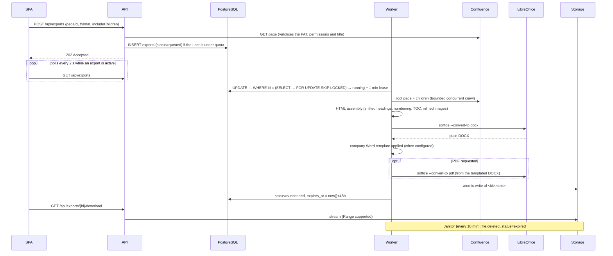

# Architecture

## Overview

A single Go binary embeds three components, selected with `APP_ROLE`:

| Role     | Components                          | Scaling                                              |
| -------- | ----------------------------------- | ---------------------------------------------------- |
| `api`    | REST API, OIDC (BFF), static SPA    | horizontal, stateless (sessions live in the database) |
| `worker` | export worker pool + janitor        | horizontal; `EXPORT_WORKER_CONCURRENCY` per pod       |
| `all`    | both (default, ideal in development)| —                                                     |

PostgreSQL is the only infrastructure dependency: it holds both the data **and** the job queue.

## Export lifecycle

States: `queued → running → succeeded | failed → expired`. A transient failure (Confluence 5xx/429, a
conversion crash) goes back to `queued` with exponential backoff up to `EXPORT_MAX_ATTEMPTS`. Deterministic
failures (invalid PAT, page not found, tree too large, timeout, template that cannot be applied) fail
immediately.

## Load control

| Mechanism                              | Setting                          |
| -------------------------------------- | -------------------------------- |
| Concurrent workers per instance        | `EXPORT_WORKER_CONCURRENCY`      |
| Parallel Confluence requests per job   | `CONFLUENCE_FETCH_CONCURRENCY`   |
| Active exports per user (429)          | `EXPORT_MAX_ACTIVE_PER_USER`     |
| Maximum tree size                      | `EXPORT_MAX_PAGES`               |
| Maximum job duration                   | `EXPORT_JOB_TIMEOUT`             |
| Maximum image size                     | `EXPORT_MAX_IMAGE_BYTES`         |
| Confluence `Retry-After` handling      | automatic (REST client)          |

Queue robustness:

- **Lease** — a worker refreshes `locked_until` every 20 s. If it dies, another worker picks the job up
  once the lease expires.
- **Ownership** — every worker write is conditioned on `locked_by = <worker>`, so a zombie worker cannot
  overwrite another's result.
- **Cancellation** — deleting a running export removes the row; the worker loses its lease, stops and
  cleans up.
- **Graceful shutdown** — on SIGTERM in-flight jobs get 20 s to finish, otherwise they return to the queue
  without consuming an attempt.

## Document rendering

`exporter.RenderHTML` produces one self-contained HTML document, which LibreOffice then converts:

- a cover page (title, date, source URL, page count) followed by a clickable table of contents;
- every page starts on a new page, with an `hN` heading where `N = depth + 1` (capped at 6) and a
  hierarchical number `1.2.3`;
- headings inside a page body are shifted below its title, so the Word/PDF outline mirrors the tree;
- images are downloaded with the user's PAT (same origin only), resized to the printable width and
  embedded as data URIs; an unreachable image degrades to its alternative text;
- links to pages included in the export become internal anchors, other links become absolute URLs;
- sanitisation: scripts, iframes, forms and event handlers are removed.

### Company Word template

When `WORD_TEMPLATE_PATH` is set, the document is produced inside the corporate template
(`internal/docx`): the template package is the base of the result, and only the generated body is injected
into it, with images, hyperlinks, list numbering and style references remapped to stay valid.

Two consequences shape the pipeline:

- the HTML is rendered **without** its own typography, because the converter would turn font declarations
  into direct formatting that overrides the template's styles;
- PDFs are produced from the templated DOCX rather than from the HTML, so both formats share one layout.

Details and authoring guidance: [word-template.md](word-template.md).

## Document storage

Documents go through the `storage.BlobStore` interface (`Put`, `Open`, `Delete`), with two implementations
selected by a feature flag at startup (see [configuration](configuration.md#document-storage-s3-feature-flag)):

| Backend    | Enabled by       | Notes                                                                          |
| ---------- | ---------------- | ------------------------------------------------------------------------------ |
| Local disk | default          | atomic write (temp file + rename); needs a shared volume when API and workers are separate |
| S3         | `S3_BUCKET` set  | single `PutObject` from a spooled temp file (no partial objects); lazy ranged GETs, so HTTP `Range` requests are served without downloading everything |

One contract test suite (`storage/contract_test.go`) runs against both backends; S3 is faked in memory with
`gofakes3`.

## Security

- **Authentication** — OIDC Authorization Code + PKCE + nonce, server side (BFF pattern). OAuth tokens
  never leave the backend; the browser only holds an opaque session cookie (`HttpOnly`, `SameSite=Lax`,
  `Secure` + `__Host-` prefix over HTTPS). Only its SHA-256 is stored.
- **CSRF** — a mandatory `X-CSRF-Protection: 1` header plus `Origin` / `Sec-Fetch-Site` checks.
- **PAT** — validated against Confluence before being saved, encrypted with AES-256-GCM bound to the user
  id, never returned by the API, and only ever sent to the configured Confluence origin (redirects to
  another host are blocked).
- **Authorisation** — every export query filters on `user_id` (another user's export looks like a 404).
  Confluence permissions are those of the user's PAT.
- **Headers** — strict CSP (`default-src 'self'`), `frame-ancestors 'none'`, `nosniff`, HSTS over HTTPS.
- **Files** — storage keys are generated and validated server-side (no path traversal), written
  atomically, and served as `Content-Disposition: attachment`.

## Observability

- Structured JSON logs (`log/slog`), one line per request with a `request_id`.
- `/healthz` (liveness), `/readyz` (database reachable).
- OpenTelemetry traces and metrics pushed over OTLP, enabled by `OTEL_EXPORTER_OTLP_ENDPOINT`
  (see [configuration](configuration.md#telemetry-opentelemetry)). An HTTP request is one trace; an export
  job is another, with a span per pipeline stage — crawl, render, convert — and one per Confluence call.
  Metrics cover the queue depth, export outcomes, durations and sizes.
- Log lines emitted inside a span carry `trace_id` and `span_id`, which links the three signals.

## Possible next steps

- Link an export job's trace to the request that queued it, by storing the W3C trace context on the row
  (a migration and a span link); today the export id is the connection between the two traces.

- Confluence Cloud: email + API token (Basic) authentication alongside the Bearer PAT.
- Export completion notifications (email, SSE); `LISTEN/NOTIFY` to wake remote workers.
- Per-user or per-space template selection, on top of the current global template.
