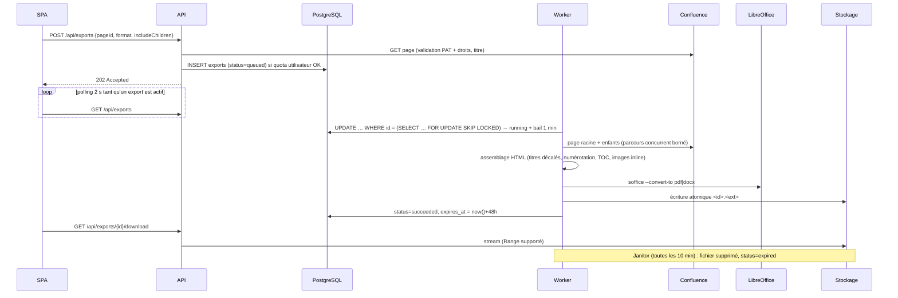

# Architecture

## Vue d'ensemble

Un binaire Go unique embarque trois composants, activables via `APP_ROLE` :

| Rôle     | Composants                          | Mise à l'échelle                                   |
| -------- | ----------------------------------- | -------------------------------------------------- |
| `api`    | API REST, OIDC (BFF), SPA statique  | horizontale, sans état (sessions en base)          |
| `worker` | pool de workers d'export + janitor  | horizontale ; `EXPORT_WORKER_CONCURRENCY` par pod  |
| `all`    | les deux (défaut, idéal en dev)     | —                                                  |

PostgreSQL est la seule dépendance d'infrastructure : données **et** file d'attente.

## Cycle de vie d'un export

États : `queued → running → succeeded | failed → expired`. Un échec transitoire (5xx/429 Confluence,
crash de conversion) repasse en `queued` avec backoff exponentiel jusqu'à `EXPORT_MAX_ATTEMPTS`.
Les erreurs définitives (PAT invalide, page introuvable, arbre trop grand, timeout) échouent immédiatement.

## Contrôle de charge

| Mécanisme                              | Paramètre                        |
| -------------------------------------- | -------------------------------- |
| Workers simultanés par instance        | `EXPORT_WORKER_CONCURRENCY`      |
| Requêtes Confluence parallèles par job | `CONFLUENCE_FETCH_CONCURRENCY`   |
| Exports actifs par utilisateur (429)   | `EXPORT_MAX_ACTIVE_PER_USER`     |
| Taille maximale d'un arbre             | `EXPORT_MAX_PAGES`               |
| Durée maximale d'un job                | `EXPORT_JOB_TIMEOUT`             |
| Taille maximale d'une image            | `EXPORT_MAX_IMAGE_BYTES`         |
| Respect du `Retry-After` de Confluence | automatique (client REST)        |

Robustesse de la file :

- **Bail (lease)** : un worker renouvelle `locked_until` toutes les 20 s. S'il meurt, le job est repris par un
  autre worker après expiration du bail.
- **Propriété** : toute écriture d'un worker est conditionnée à `locked_by = <worker>` ; un worker « zombie »
  ne peut pas écraser le résultat d'un autre.
- **Annulation** : supprimer un export en cours supprime la ligne ; le worker perd son bail, s'arrête et nettoie.
- **Arrêt gracieux** : sur SIGTERM, les jobs en cours ont 20 s pour finir, sinon ils sont remis en file
  sans consommer de tentative.

## Rendu du document

`exporter.RenderHTML` produit un HTML autonome ensuite converti par LibreOffice :

- page de garde (titre, date, URL source, nombre de pages) puis table des matières cliquable ;
- chaque page commence sur une nouvelle page, avec un titre `hN` où `N = profondeur + 1` (max 6)
  et une numérotation hiérarchique `1.2.3` ;
- les titres internes d'une page sont décalés sous le titre de la page → le plan Word/PDF reflète l'arbre ;
- images téléchargées avec le PAT (même origine uniquement), redimensionnées à la largeur utile et
  embarquées en data URI ; image inaccessible → texte alternatif ;
- liens vers des pages incluses dans l'export → ancres internes ; autres liens → URL absolues ;
- nettoyage : scripts, iframes, formulaires, gestionnaires d'événements supprimés.

## Sécurité

- **Authentification** : OIDC Authorization Code + PKCE + nonce, côté serveur (pattern BFF). Les jetons
  OAuth ne quittent jamais le backend ; le navigateur n'a qu'un cookie de session opaque
  (`HttpOnly`, `SameSite=Lax`, `Secure` + préfixe `__Host-` en HTTPS). Seul le SHA-256 est stocké.
- **CSRF** : en-tête `X-CSRF-Protection: 1` obligatoire + vérification `Origin` / `Sec-Fetch-Site`.
- **PAT** : validé auprès de Confluence avant enregistrement, chiffré AES-256-GCM avec l'id utilisateur en
  donnée associée, jamais renvoyé par l'API, envoyé uniquement à l'origine Confluence configurée
  (redirections vers un autre hôte bloquées).
- **Autorisation** : toutes les requêtes d'export filtrent sur `user_id` (un export d'autrui = 404).
  Les droits Confluence sont ceux du PAT de l'utilisateur.
- **En-têtes** : CSP stricte (`default-src 'self'`), `frame-ancestors 'none'`, `nosniff`, HSTS en HTTPS.
- **Fichiers** : clés de stockage générées côté serveur et validées (pas de traversée de chemin),
  écriture atomique, téléchargement `Content-Disposition: attachment`.

## Observabilité

- Logs JSON structurés (`log/slog`), un log par requête avec `request_id`.
- `/healthz` (liveness), `/readyz` (base joignable).
- Métriques Prometheus sur un port séparé (`METRICS_ADDR`, défaut `:9090`) :
  `c2d_queue_queued`, `c2d_queue_running`, `c2d_exports_created_total`, `c2d_exports_finished_total{outcome}`,
  `c2d_export_duration_seconds`, `c2d_export_pages`, `c2d_http_request_duration_seconds`.

## Évolutions envisagées

- Stockage objet (S3/MinIO) : implémenter `storage.BlobStore` (nécessaire si API et workers n'ont pas de volume partagé).
- Confluence Cloud : authentification e-mail + API token (Basic) en plus du Bearer PAT.
- Notification de fin d'export (e-mail, SSE) ; `LISTEN/NOTIFY` pour réveiller les workers distants.
